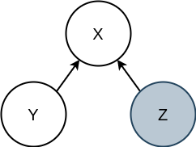

# variational-models
A pytorch implementation of semi-supervised variational models for investigable machine learning.

## About the project

For methodological details about the model please **refer to the ZABROCKI_Master_Thesis.pdf chapter methods, section variational inference**.

## Notebooks

In addition to the model code, the project contains illustrative notebooks.

## Author

Simon Zabrocki

## Acknowledgements

This project was developped as part of my Master Thesis (TUM/Helmholtz Zentrum).